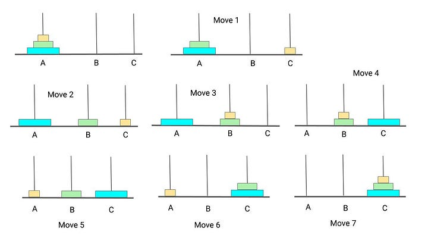
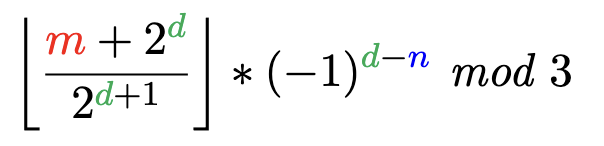

# Tower Of Hanoi Simulation - 50 Disks

Above is an image of the Tower of Hanoi. The game has three pegs and some number of differently sized disks. All disks start on the leftmost peg and must be moved to the rightmost peg to win the game. Note that the largest disks are at the bottom and the smallest at the top, with all disks in this decreasing order upwards. There are three important rules on how these disks can be moved.
  1. Only one disk can be moved at a time.
  2. The disk moved must be the topmost disk on any given peg.
  3. No disk can be placed on a disk smaller than it.

There has been significant research already completed about the optimal strategy. In this case, 'optimal' means winning the game in the least amount of moves. The strategy varies slightly based on the total number of disks. The optimal strategy for three disks is depicted below:

Much is known about the optimal solution in a recursive setting. My team found that information about the tower not relying on recursion was lacking. In my research, which is soon to be published in Mathematics Magazine, my team was able to create non-recursive equation to determine the location of any disk on any move in the optimal solution. Note that this website was created before we had entirely completed the project, so some notation will be different between here and our published version. Our formula relies on labeling the pegs as 0, 1, and 2 from left to right. We also label the disks 0 to n-1 from smallest to largest for any number of disks represented by n. 

In our formula, m is the move number, d is the disk number, and n is the total number of disks. The output of the formula gives the peg number (0, 1, or 2) that the disk is currently on by the end of move m. The version of the formula that this website employs is:

This website is only made for cases in which n is equal to 50. It was originally created with mobile devices in mind because it was presented as a QR code during our presentations at conferences. The user is able to enter any valid move number at the top of the screen. Once submitted, the website calculates the position of all disks, 0-49, based on our formula and outputs the results in a table. This is one of the first websites I have ever made, so the styling and design could certainly be improved.
